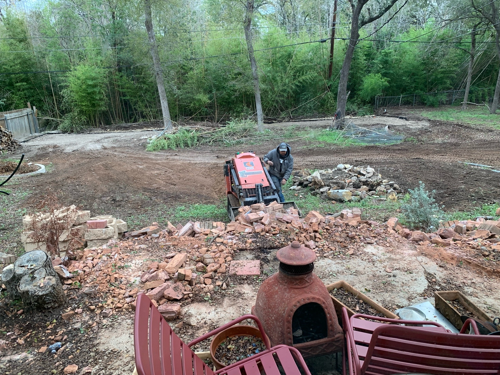

is a home for being in, for cradling outside the harsh edges of the world? is it for inviting, for sharing and laying open?

maybe one reason people like work is you get relationships but with guarantees of civility and of consistency. 