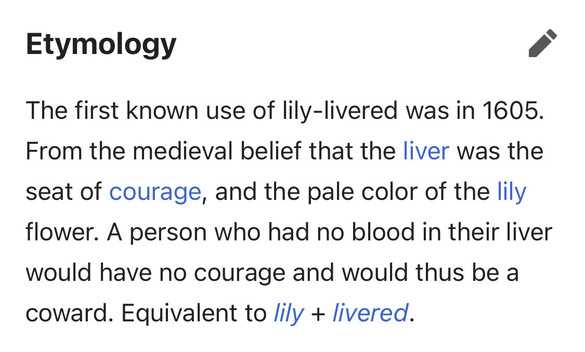

> The first known use of lily-livered was in 1605. From the medieval belief that the liver was the seat of courage, and the pale color of the lily flower. A person who had no blood in their liver would have no courage and would thus be a coward. Equivalent to lily + livered.
>
>[Wiktionary](https://en.wiktionary.org/wiki/lily-livered)

lily-livered apparently means cowardly and just comes from the color of lilys being pale and thus not courageous.