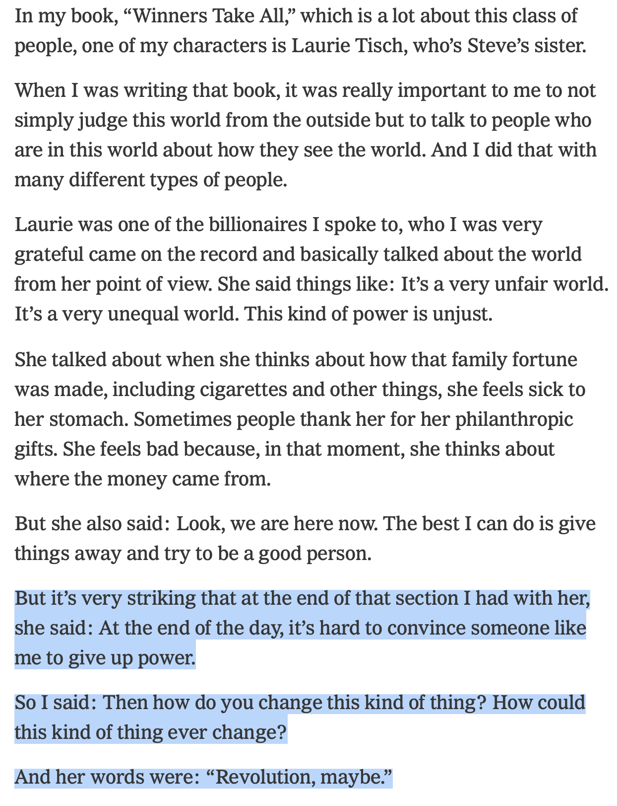

> But it’s very striking that at the end of that section I had with her [Laurie Tisch], she said: At the end of the day, it’s hard to convince someone like me to give up power.
>
> So I said: Then how do you change this kind of thing? How could this kind of thing ever change?
> 
> And her words were: “Revolution, maybe.”
> 
> —[Anand Giridharadas on the Ezra Klein Show](https://www.nytimes.com/2026/02/13/opinion/ezra-klein-podcast-anand-giridharadas.html)